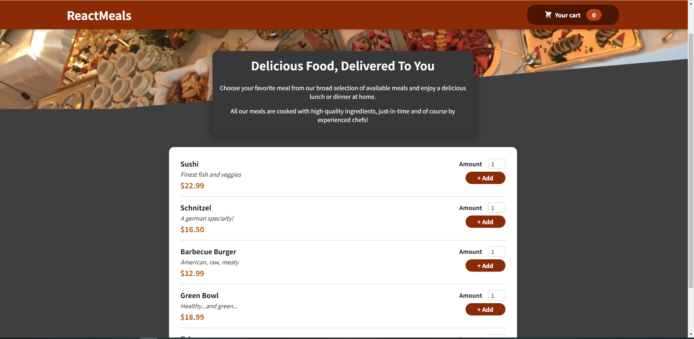
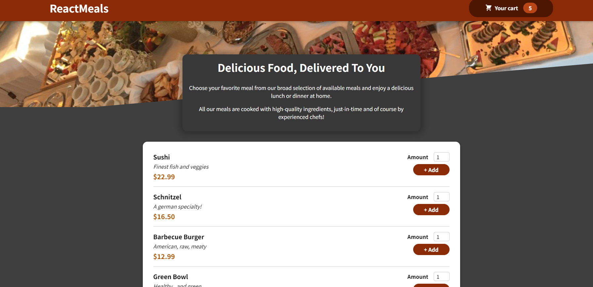
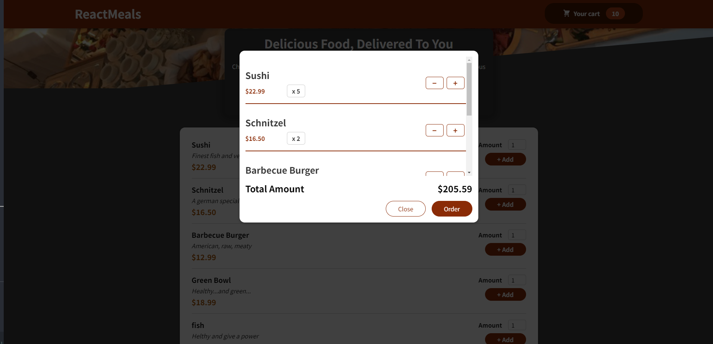
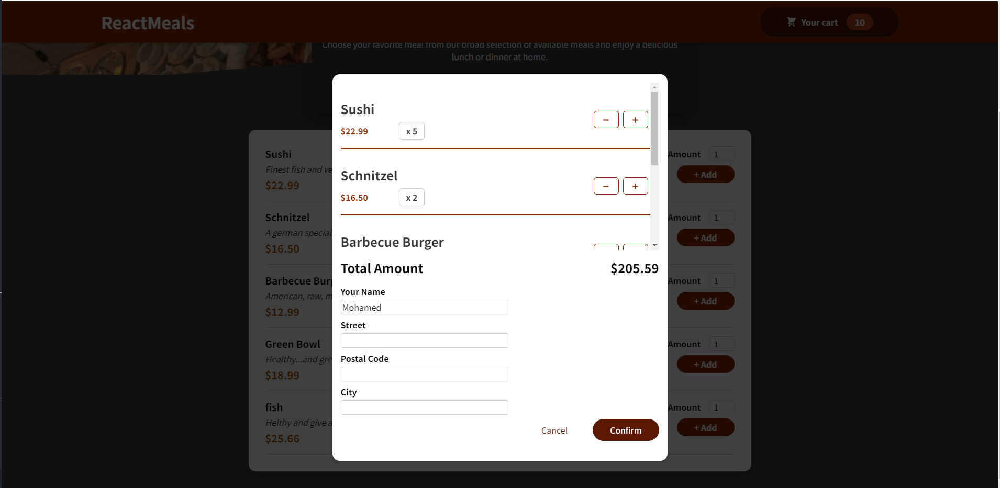
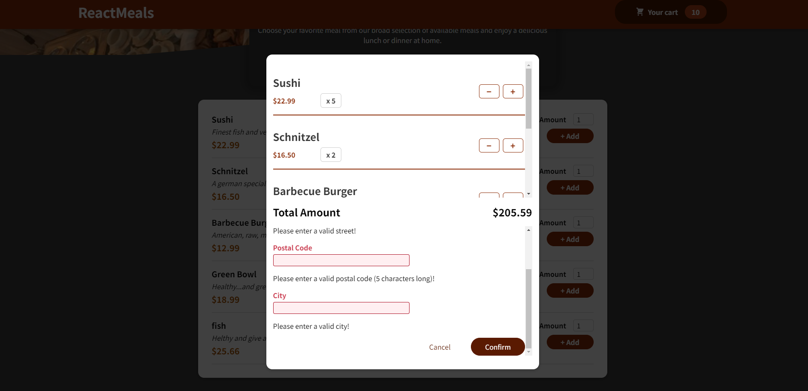
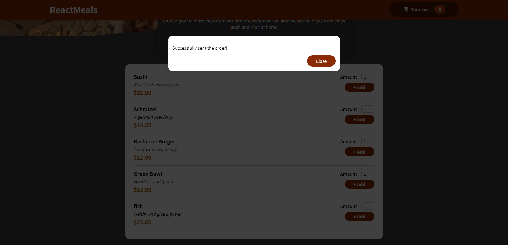
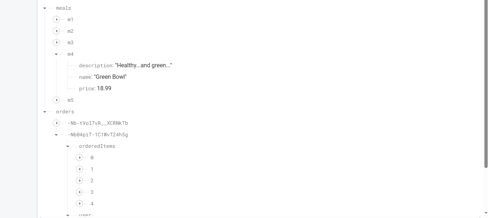
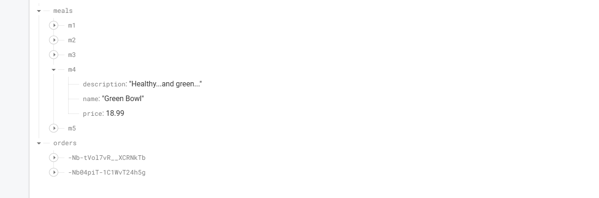

# Food-Order-App

The Food Order App is a React application that allows users to conveniently order food online. Users can select their desired items from the available menu, add them to their cart, and proceed to confirm the order. The cart displays essential information, such as the total amount to be paid, the number of meals for each type, and the price of each type of meal. Once the user confirms the order, a form with simple validation prompts the user to enter their details. After confirmation, the order data is sent to the backend on Firebase, and a confirmation message is displayed to the user. All meal data is securely saved on the Firebase backend.

## Installation

1-Clone this repository to your local machine: on terminal

https://github.com/Mohamed-Ramadan1/Food-Order-App.git

2- run : npm install

3-run : npm start

## Usage

1-Browse the available menu and select the desired items by specifying the needed amount.

2-Click the "Add to Cart" button to add the selected items to your cart.

3-The cart will display a summary of your order, including the total amount to be paid, the number of meals for each type, and the price of each type of meal.

4-To confirm your order, click the "Confirm Order" button.

5-Fill out the form with your details, ensuring all required fields are filled correctly.

6-Click the "Confirm" button to place your order.

7-The order data will be securely sent to the backend on Firebase, and a confirmation message will be displayed.

## Features

1-Browse and select from a variety of food items.

2-Add and remove items to/from the cart.

3-View a detailed summary of the order in the cart.

4-User-friendly form with simple validation for order confirmation.

5-Secure data transmission to the Firebase backend.

6-Order confirmation message for users.

## App-preview

